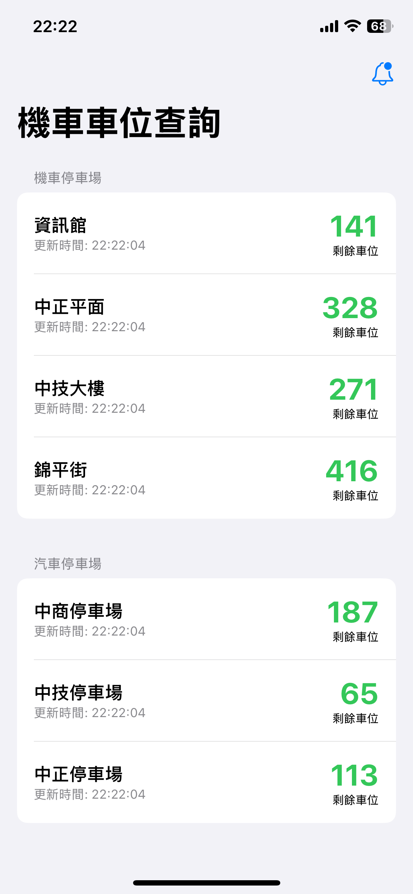

# 🛵 NUTCParkingSpace - 中科大停車位查詢

**NUTCParkingSpace** 是一款專為國立臺中科技大學（NUTC）師生設計的 iOS 應用程式。透過精美的介面與強大的 Widget 功能，讓您隨時隨地掌握校內機車停車場的即時剩餘車位，告別在停車場門口排隊空等的困擾。

## ✨ 功能特色

- **即時車位查詢**: 直接連結學校伺服器，提供最準確的即時車位數據。
- **桌面小工具 (Widgets)**: 支援 iOS 主畫面 Widget，無需打開 App 即可查看特定停車場的剩餘車位。
- **動態島與即時動態 (Live Activity)**: 支援 iPhone 14 Pro 以上機型的動態島顯示，以及鎖定畫面即時動態，讓您在騎車通勤途中也能輕鬆瞄一眼剩餘車位。
- **智慧通勤模式**: 結合地理圍欄 (Geofencing) 技術，當您接近學校時自動觸發通知，貼心提醒當前車況。
- **質感設計**: 採用現代化 SwiftUI 設計語言，提供流暢且舒適的操作體驗。

## 📱 畫面預覽

| 主畫面 | Widget 小工具 | 即時動態 |
|:---:|:---:|:---:|
|  |  |  |

## 🛠️ 使用技術

本專案完全以 Swift 語言開發，並運用最新的 iOS 開發框架：

- **Swift 6**: 採用最新版 Swift 語言特性。
- **SwiftUI**: 100% 聲明式 UI 建構。
- **WidgetKit**: 打造可高度客製化的桌面小工具。
- **ActivityKit**: 實作動態島與即時動態功能。
- **CoreLocation**: 用於地理圍欄與通勤模式的定位服務。
- **UserNotifications**: 發送及時的車位狀況通知。

## 📋 需求與相容性

- **iOS 版本**: iOS 17.0 或以上
- **開發環境**: Xcode 16.0 或以上

## ⚠️ 免責聲明

本應用程式為個人開發之非官方軟體，僅供學術交流與便利使用。
停車位數據來源為國立臺中科技大學官方網站，實際車位數量以現場顯示為準。本程式不對數據的即時性與準確性負完全責任。

---

Made with ❤️ by Yulin494、justin0427
