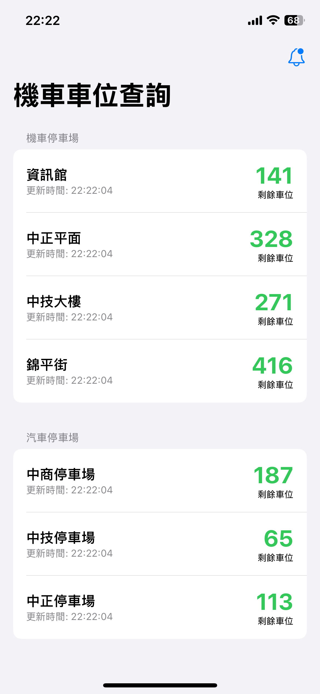
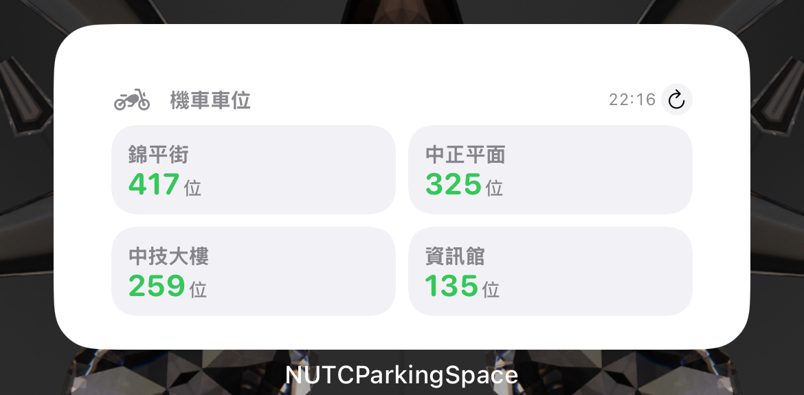

# 中科大校園通 NUTCParkingSpace

**中科大校園通** 是一款專為國立臺中科技大學（NUTC）師生設計的 iOS 全校園服務應用程式。從即時停車位到課表管理、天氣、公告、圖書館，將校園日常所需整合在一個 App。

## 功能特色

### 首頁 Dashboard
- 時段問候語與當日日期
- 即時天氣卡片（動態漸層、溫度/體感/濕度/風速）
- 今日課程橫向快覽
- 待辦作業緊急度提示
- 機車車位快速統計
- 學術行事曆倒數捷徑

### 停車場即時查詢
- 直連學校伺服器，提供機車、汽車各停車場即時剩餘車位
- 動態島 & 鎖定畫面即時動態（Live Activity）
- 長按啟動追蹤，通勤中隨時掌握車位變化
- 智慧到校推播：進入學校 1000 公尺自動通知

### 課業管理
- 課表新增、編輯（衝堂自動偵測）
- 作業追蹤：urgency 色條卡片（紅/橙/黃/藍）
- 課程與作業到期前通知
- 課表匯出至 Apple 行事曆

### 校園服務（校園 Hub）
- **校園公告**：分類篩選（全校/學術/徵才/活動），WebView 內嵌閱覽
- **學術行事曆**：114 學年度完整行程，倒數天數，可匯出至日曆
- **台中天氣**：Open-Meteo 即時資料，含逐時預報
- **圖書館**：即時開放狀態、樓層指引、服務說明、館藏查詢
- **育才街美食**：周邊餐廳 2 欄卡片，依類別篩選
- **YouBike**：附近站點即時可借/可停數量
- **學校系統**：學生入口、教務處、學務處、計算機中心等 WebView
- **緊急聯絡**：校安/健康中心/警衛/119/110 一鍵撥打

### 桌面小工具（Widgets）
| 小工具 | 尺寸 | 說明 |
|--------|------|------|
| 停車場車位 | Small / Medium / 鎖定畫面 | 即時剩餘車位 |
| 台中天氣 | Small / Medium / 鎖定畫面 | 即時氣象 + 逐時預報 |
| 學術行事曆 | Small / Medium / 鎖定畫面 | 下一個重要行程倒數 |
| 今日課表 | Small / Medium / 鎖定畫面 | 當天課程一覽 |

## 畫面預覽

| 首頁 | 停車場 | Widget 小工具 |
|:---:|:---:|:---:|
||||

## 使用技術

| 技術 | 用途 |
|------|------|
| Swift 6 + SwiftUI | 全 UI 宣告式建構 |
| SwiftData | 課表、作業本地持久化 |
| WidgetKit | 4 種桌面小工具 |
| ActivityKit | 動態島 / 即時動態 |
| CoreLocation | 地理圍欄到校推播 |
| UserNotifications | 課程 / 作業到期通知 |
| EventKit | 學術行事曆匯出 |
| WKWebView | 公告、學校系統內嵌瀏覽 |
| Open-Meteo API | 免費天氣資料（無需 API Key）|
| App Group | App ↔ Widget 資料共享 |
| NUTCParkingShared | 自訂 Swift Package，共用模型與服務 |

## 需求

- **iOS**: 18.4 或以上
- **Xcode**: 16.0 或以上
- **裝置**: iPhone（不支援 iPad / Mac Catalyst）

## 專案結構

```
NUTCParkingSpace/
├── Features/
│   ├── Home/          # 首頁 Dashboard
│   ├── Parking/       # 停車場查詢 + Live Activity + Onboarding
│   ├── Schedule/      # 課表管理
│   ├── Homework/      # 作業追蹤
│   ├── Calendar/      # 學術行事曆
│   ├── Announcements/ # 校園公告
│   ├── Weather/       # 天氣
│   ├── Dining/        # 育才街美食
│   ├── Transport/     # YouBike
│   ├── Library/       # 圖書館
│   ├── Portal/        # 學校系統
│   ├── Emergency/     # 緊急聯絡
│   ├── Hub/           # 校園 Hub / 課業 Hub
│   ├── Settings/      # 設定
│   └── Shared/        # 共用 UI 元件（DesignSystem）
├── ParkingWidget/     # WidgetKit Extension（4 種小工具）
└── NUTCParkingShared/ # Swift Package（模型 + 服務）
```

## 免責聲明

本應用程式為個人開發之非官方軟體，僅供學術交流與便利使用。停車位數據來源為國立臺中科技大學官方網站，實際車位數量以現場顯示為準。

---

Made with  by Yulin494、justin0427
